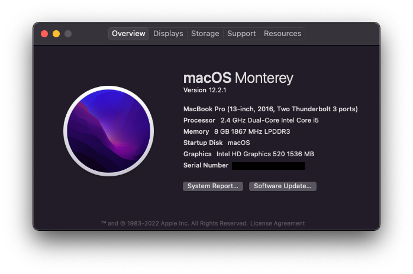
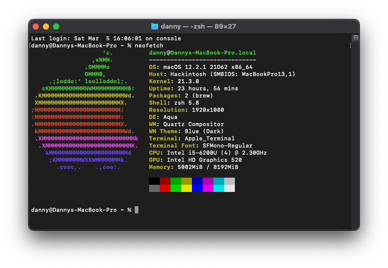
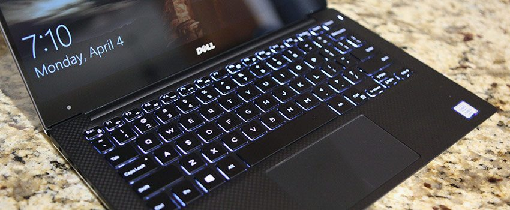

### XPS 13 9350 Hackintosh running macOS

#

### OpenCore 0.7.8 | macOS Monterey 12.2.1
#

#

### 📸 About

#

### 💻 Hardware

#

### 📃 Specs

* CPU: Intel Core i5-6200U Skylake
* GPU: Intel HD Graphics 520 
* RAM: 8GB DDR3
* Boot Drive: Sabrent 1TB NVME SSD
* OS: macOS macOS Monterey, Windows 10, Ubuntu 20.04
* WIFI/Bluetooth: Replaced stock DW1820A with a DW1560
* Audio/Mic: Realtek ALC256 (had to install ComboJack along with AppleALC for headphones to work)
#

### 👍 Working 
* Power/Battery
* Sleep/wake
* TouchPad
* Keyboard
* Brightness/brightness keys
* Webcam 
* USB 
* HDMI (via usb C)
* Wifi
* Bluetooth
* iMessage
* Facetime
#

### ❌ Not Working:
*  Thunderbolt hotplug
*  SD card reader (never use it - disabled in BIOS)
#

### ❗️ Usage (How to install)

1. Fill the [SMBIOS](https://dortania.github.io/OpenCore-Install-Guide/config.plist/coffee-lake.html#platforminfo) section according to this guide. 
2. Update BIOS to the latest version
#
  
### 🙏 Credits - 
  
 1. A huge thanks to [dortania](https://dortania.github.io/OpenCore-Install-Guide/) for their incredibly detailed guide.
